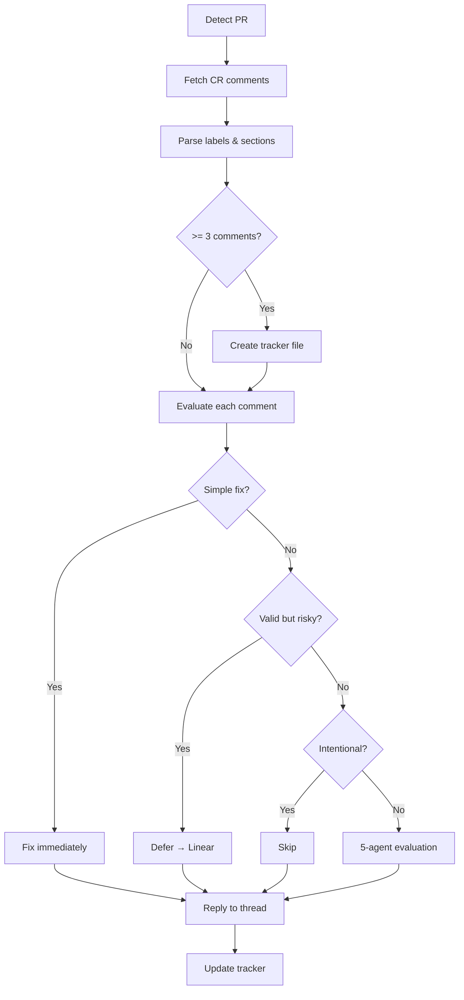

# CodeRabbit Review Skill for Claude Code

A Claude Code skill that evaluates CodeRabbit PR review comments using multi-agent analysis, auto-fixes simple issues, and tracks deferred items in Linear.

## Features

- **Auto-detect PRs** from current branch
- **Parse CodeRabbit labels** (`_🔴 Critical_`, `_📝 Nitpick_`, etc.)
- **Extract collapsible sections** (`<details>` tags, analysis chains)
- **Multi-agent evaluation** (5 specialized agents analyze each comment)
- **Auto-fix simple nitpicks** (AI time is cheap)
- **Linear integration** for deferred items
- **Always respond** to CodeRabbit threads

## Quick Start

1. Copy this folder to your project or Claude Code skills directory
2. Trigger with: `check in with coderabbit` or `check in with CR`

## Structure

```
coderabbit-review/
├── SKILL.md              # Main skill definition
├── agents/               # 5 specialized analysis agents
│   ├── repo-archeologist.md
│   ├── behavior-validator.md
│   ├── architecture-reviewer.md
│   ├── test-safety-checker.md
│   └── security-performance.md
├── references/           # Decision trees & templates
│   ├── tracker-format.md
│   ├── response-templates.md
│   ├── skip-patterns.md
│   ├── evaluation-criteria.md
│   └── ...
└── examples/
    └── sample-evaluation.md
```

## Workflow



## Requirements

- GitHub CLI (`gh`) for API access
- Linear MCP server (optional, for backlog items)
- Claude Code with Task tool support
